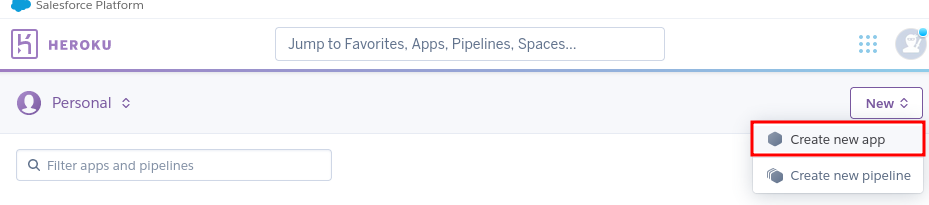
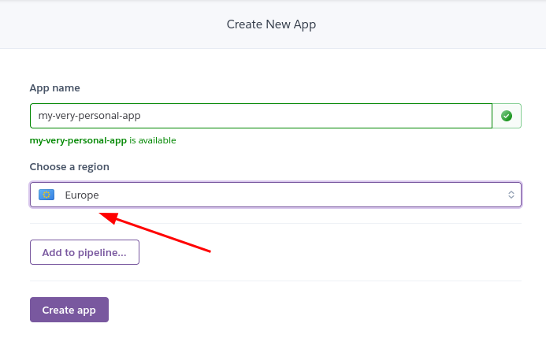
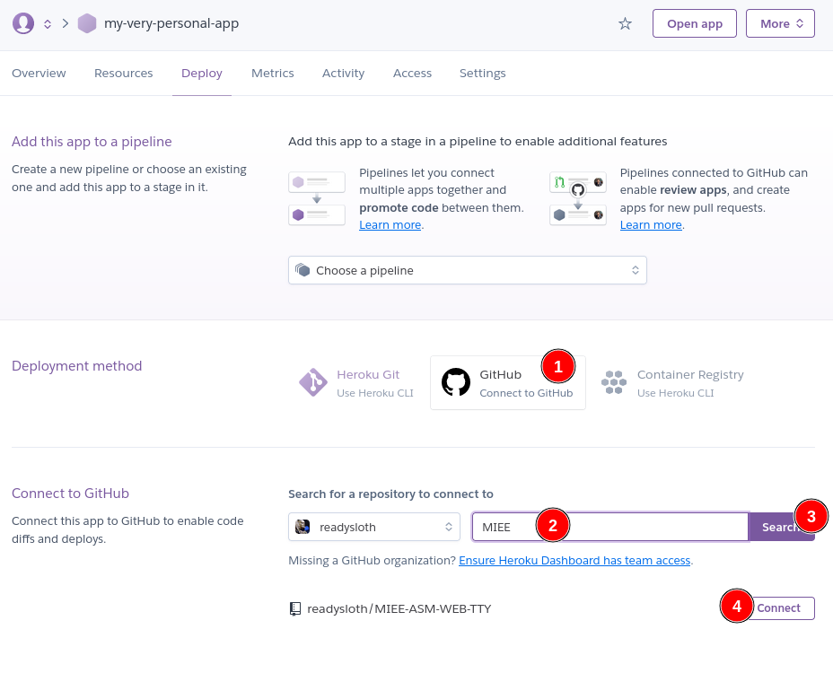
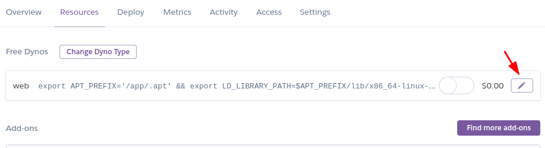
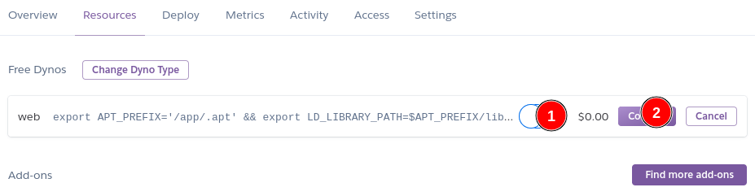
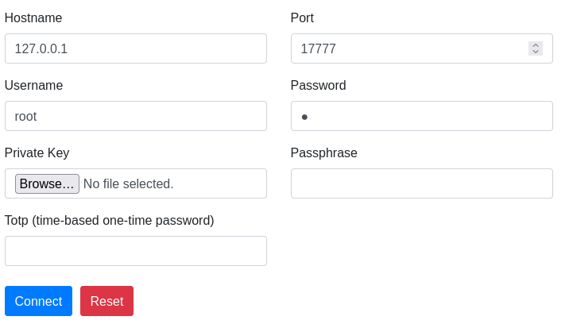

# RU
## MIEE-ASM-WEB-TTY

Веб-интерфейс для виртуальной машины с терминальными утилитами для выполнения лабораторных работ.

### Предварительная конфигурация

1. Создать аккаунт на [heroku](https://www.heroku.com/)
1. Fork'нуть данный репозиторий себе на github
  + Если у вас нет github (как так?), то [создать аккаунт](https://github.com/)
1. Создать новое приложение 
  1. Как-нибудь назвать и выбрать регионом Европу 
  1. Нажать *Create app*
    1. Идем в меню *Settings*
      1. В пункте `Buildpacks` добавляем
        + `heroku/python` 
        + `https://github.com/heroku/heroku-buildpack-apt` 
    1. Идем в меню *Deploy* 
   
      1. Кликаем на подключение через GitHub
      1. Ищем имя fork'нутого репозитория
      1. Подключаем его, нажав *Connect*
      1. После небольшого ожидания нажимаем *Deploy Branch*
   1. Идем в меню *Resources*
    1. Нажимаем на кнопки: 
     
     
      после завершения работы рекомендуется отключить
      виртуальную машину тем же образом, как вы ее и включали,
      чтобы не тратить квоту времени исполнения.

### Запуск

Теперь достаточно нажать кнопку `Open app` и перейти к web-ssh интерфейсу виртуальной машины.

Поля заполняем, как на картинке, пароль у пользователя `root` по-умолчанию `1`

Нажимаем *Connect* и все, вы прекрасны.

[Пример](https://miee-asm-web-tty.herokuapp.com/) (но он может не работать).

Если сразу не подключилось, то подождите немного, пока виртуальная машина запустится.

В консоли можно написать `source /etc/profile/` и попасть в многооконный консольный интерфейс.
[Горячие клавиши для tmux'a.](https://github.com/dennyzhang/cheatsheet-tmux-A4)

Виртуальная машина основана на дистрибутиве alpine.
В ней используется пакетный менеджер `apk`.
Для установки пакета нужно выполнить команду `apk add имя_пакета1 имя_пакета2 ...`.
Сейчас установлены следующие пакеты:
 + elinks - консольный браузер
 + gdb - отладчик
 + gcc и g++ - компиляторы
 + make
 + strace - отслеживатель системных вызовов
 + tmux - терминальный мультиплексор
 + vim - текстовый редактор (можно поставить nano через `apk add nano`)
 + git

